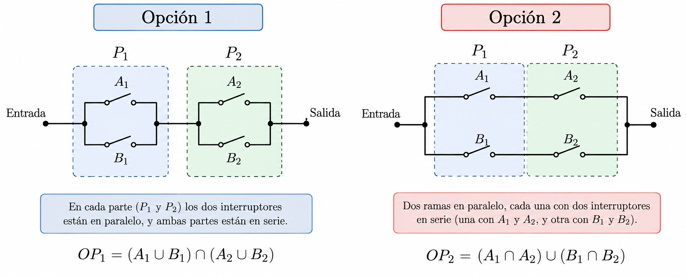

# Taller 1 · Probabilidad

## Probabilidad de éxito en dos configuraciones de un motor

Taller introductorio de probabilidad para el **curso introductorio probabilidad y estadística**.

El objetivo es comparar la fiabilidad de dos configuraciones de un sistema formado por cuatro interruptores independientes, combinando:

* operaciones con sucesos;
* inclusión y monotonía de la probabilidad;
* independencia;
* cálculo explícito de probabilidades;
* simulación y representación gráfica con `R`;
* estudio de una función mediante herramientas de cálculo.

  

## Material.

Lo más práctico e clonar o descaragr el repositorio en local.

* [Ver el taller en HTML](https://ricuib.github.io/taller_motores/)
* [Código fuente R Markdown](MotoresProbabilidad_Solucion.Rmd)
* [Versión PDF](MotoresProbabilidad_Solucion.pdf)

## Contenidos

1. Planteamiento del problema.
2. Comparación mediante inclusión de sucesos.
3. Cálculo explícito de las probabilidades.
4. Exploración numérica y gráfica con `R`.
5. Comparación algebraica.
6. Estudio de la máxima ganancia de fiabilidad.
7. Pregunta adicional sobre coste y fiabilidad.

## Software

El documento ha sido elaborado con:

* R
* R Markdown
* knitr

## Autor

Material docente para la asignatura **Fundamentos de la Probabilidad y de la Estadística**.
